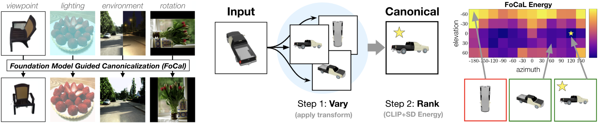

# FoCal: Test-Time Canonicalization by Foundation Models for Robust Perception

[](https://arxiv.org/abs/2507.10375)
[](./LICENSE)


[](https://black.readthedocs.io/en/stable/)
[](https://github.com/pre-commit/pre-commit)


This is the official repository for the paper "Test-Time Canonicalization by Foundation Models for Robust Perception" (ICML 2025).

### [Paper](https://arxiv.org/abs/2507.10375) | [Project Website](https://utkarsh.ai/projects/focal)



## Basic organization:
- Each task is a python script of its own (in `experiments/` folder)
- Each python file imports from `focal/utils`, which contain most of the dependencies and library code.
- In particular, `focal/utils/energy.py` contains the energy function used for optimization.
- You can run the experiments using the following command:

```bash
python -m experiments.rotation_2D # Replace `rotation_2D` with the name of the task you want to run.
```

## Installation
The recommended way to install the code is using [uv](https://github.com/astral-sh/uv) package manager, however, we also provide a `requirements.txt` file for pip users.

We have tested the code with Python 3.9 and CUDA 12.8.

Recommended installation (uv):
```
pip install uv
uv sync
uv add . --dev
uv run -m experiments.rotation_2D # Run the 2D rotation experiment
```

pip installation:
```
pip install -r requirements.txt
pip install -e .
python -m experiments.rotation_2D
```

**Note**: You might need additional dependencies for specific tasks such as active vision (gaussian-splatting) and 3D viewpoints. See below for details.

### Gaussian Splatting for Active Vision
In order to run the active vision experiments, you need to download the Gaussian Splatting libraries and datasets. You can do this by running the following script:

```
# Install gaussian splatting dependencies
apt-get install python3-opencv # Install OpenCV if not already installed
source .venv/bin/activate # Activate the virtual environment (necessary for uv users)
bash scripts/download_gaussian_splatting_libraries.sh

# Download pretrained models and datasets
cd gaussian_splatting/
wget https://repo-sam.inria.fr/fungraph/3d-gaussian-splatting/datasets/pretrained/models.zip
unzip models.zip -d pretrained
wget http://storage.googleapis.com/gresearch/refraw360/360_v2.zip
unzip 360_v2.zip -d data
```
